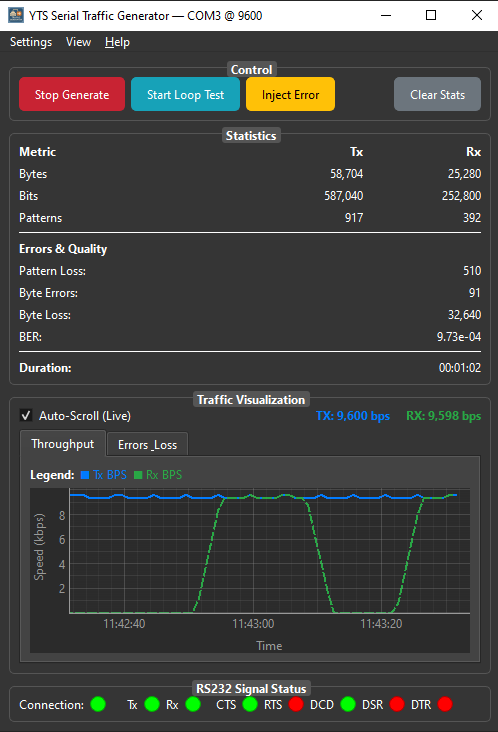
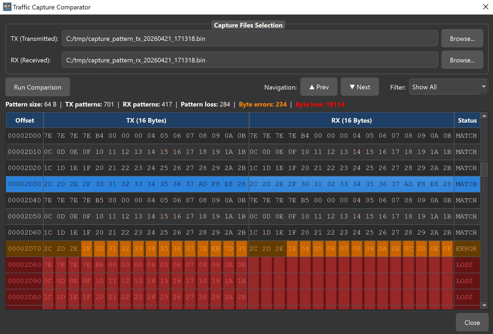
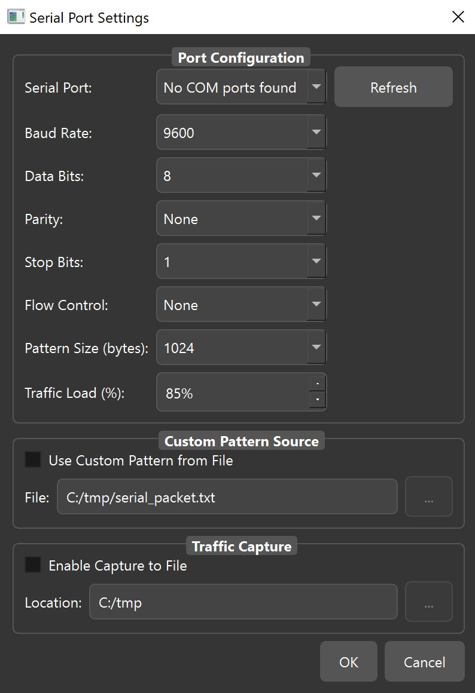

# YTS Serial Traffic Generator

### Prove the link, don't just hope

**RS-232 · RS-485 · Patterns & PRBS · Error injection · Byte comparator**

The complete COM-port testing suite. Monitor live traffic, generate standard or custom patterns,
inject errors on demand — and let the smart-alignment comparator point at the exact byte that went
wrong.

 

 

Live statistics, error quality metrics, throughput graph and RS-232 signal status in one window

---

## What it is

**YTS Serial Traffic Generator** is a desktop tool for Windows that pushes known traffic down a
serial link and tells you, precisely, what came back.

Configure any RS-232 or RS-485 port to spec, generate standard or custom patterns at a chosen
traffic load, and watch Tx/Rx bytes, bits, patterns, throughput and **bit error rate** update live
while the link runs. Inject parity, framing and data errors on demand to see how the device under
test copes. When something does go wrong, capture both streams and let the comparator align them and
highlight the exact bytes that changed or vanished.

> Download and full details:
> **https://yts-hub.com/serial-generator/**

---

## Highlights

|  | |
|---|---|
| ⚙️ **Comprehensive port config** | Baud rate, data bits, parity, stop bits and flow control — any RS-232 or RS-485 link, exactly to spec. |
| 🔁 **Pattern generation** | Standard test patterns — incrementing, walking bits, PRBS — at your chosen pattern size and traffic load. |
| ✎ **Custom patterns** | Load your own byte sequence from a file to reproduce a specific protocol frame or a known-bad payload. |
| 💥 **Error injection** | Introduce parity, framing and data errors on demand and watch how the far end recovers. |
| 📊 **Live statistics** | Tx/Rx bytes, bits and patterns, pattern loss, byte errors, byte loss and a running **BER** figure. |
| 📈 **Traffic visualisation** | Live throughput graph with a separate errors/loss view, auto-scrolling as the test runs. |
| 🚦 **RS-232 signal status** | Tx, Rx, CTS, RTS, DCD, DSR and DTR shown as live indicators — see the handshake, don't guess it. |
| 🔄 **Loopback test mode** | Verify cabling and adapters instantly before you trust the link. |
| 🎯 **Smart-alignment comparator** | Diff transmitted against received, byte by byte, with alignment that survives inserted or dropped bytes. |

---

## The star feature — find the corrupted byte

Send a known pattern, capture what arrives, and let the comparator do the staring for you.

* **Smart alignment** — automatically aligns the sent and received streams even when bytes are
  inserted or dropped, so a single glitch doesn't cascade into thousands of false mismatches.
* **Byte-by-byte visual diff** — every row is classified `MATCH`, `ERROR` or `LOSS` and colour-coded
  in a clear hex view. No squinting at raw logs.
* **Error region navigation** — jump straight from one error region to the next with Prev/Next, or
  filter the view down to just the failures.
* **Headline counters** — pattern size, TX and RX pattern counts, pattern loss, byte errors and byte
  loss, all at the top of the window.

---

## Port configuration

Everything the link needs in one dialog: standard port parameters, **pattern size** and **traffic
load** to dial the stress level, an optional **custom pattern from file**, and **traffic capture to
file** — which is what feeds the comparator afterwards.

---

## Problems it actually solves

| | |
|---|---|
| 🔍 **"Cable, adapter, or my code?"** | Loopback clears the adapter, then pattern tests across the real cable at increasing baud rates. In ten minutes you know which link drops bytes — with statistics to prove it. |
| 🏭 **Commissioning a PLC line** | Soak-test every RS-485 drop with continuous patterns overnight. The error report tells you which terminals need rewiring while it's still cheap to fix. |
| ⚡ **Surviving bad data** | Inject parity and framing errors on purpose and watch how the device under test recovers. Firmware that only ever saw clean input fails in the field — this finds it in the lab. |
| 📐 **Qualifying a converter** | Send a known pattern through a USB-serial converter or serial-to-IP gateway and diff what arrives. Latency, dropped bytes and silent corruption all show up in one view. |

---

## Who it's for

| | |
|---|---|
| 🏭 **Industrial engineers** | Validate PLC, SCADA and Modbus links on the plant floor before commissioning. |
| 🔧 **Embedded developers** | Debug UART traffic and firmware serial protocols during bring-up and testing. |
| 🛠️ **Field technicians** | Diagnose flaky cabling and adapters on site with loopback and error injection. |
| 🎓 **Students & educators** | Learn RS-232/RS-485 fundamentals with real, observable serial traffic. |

---

## Full feature list

<b>Serial communication</b>

COM port communication · RS-232 and RS-485 testing · configurable baud rate · configurable data
bits, parity, stop bits and flow control · RS-232 signal status indicators (Tx, Rx, CTS, RTS, DCD,
DSR, DTR)

<b>Traffic generation</b>

Standard test patterns (incrementing, walking bits, PRBS) · custom pattern from file · configurable
pattern size · configurable traffic load percentage · ASCII / HEX / binary transmission · automatic
packet repetition · timed and continuous generation · randomised traffic patterns

<b>Monitoring & diagnostics</b>

Real-time traffic monitoring · Tx/Rx byte, bit and pattern counters · pattern loss, byte errors and
byte loss · bit error rate (BER) · run duration · live throughput graph · separate errors/loss graph ·
timestamped logging · HEX + ASCII display · error detection

<b>Testing & verification</b>

Loopback test mode · error injection (parity, framing, data) · traffic capture to file ·
smart-alignment Tx/Rx comparator · MATCH / ERROR / LOSS classification · error-region navigation ·
result filtering · statistics and error reporting

<b>Use cases</b>

Embedded systems development · PLC diagnostics · industrial equipment testing · UART debugging ·
protocol reverse engineering · cable and adapter qualification · converter and gateway validation

---

## Technical specifications

| | |
|---|---|
| **OS** | Windows 10 / 11 (64-bit) |
| **Interfaces** | RS-232, RS-485 — any Windows COM port |
| **Port parameters** | Baud rate, data bits, parity, stop bits, flow control |
| **Patterns** | Incrementing, walking bits, PRBS, custom byte sequences from file |
| **Error injection** | Parity, framing and data errors on demand |
| **Metrics** | Tx/Rx bytes, bits, patterns · pattern loss · byte errors · byte loss · BER · throughput |
| **Analysis** | Smart-alignment comparator · statistics & error reporting |
| **Install** | Standard installer — no additional runtimes |
| **Licence** | Currently free for personal and commercial use |

---

## Download

### [⬇ Get the Serial Traffic Generator](https://yts-hub.com/serial-generator/)

**https://yts-hub.com/serial-generator/**

The installer and full product details are on the product page.

---

## FAQ

<b>Does it work with USB-to-serial adapters?</b>

Yes — it drives any port Windows exposes as a COM port, including USB-serial converters. Qualifying
those converters is one of the things it's best at: send a known pattern through and diff what comes
out the other side.

<b>What does the comparator actually compare?</b>

Two capture files — the transmitted stream and the received stream — which the tool can record for
you via **Traffic Capture** in the settings dialog. It aligns them, then classifies every 16-byte row
as `MATCH`, `ERROR` or `LOSS`.

<b>Why smart alignment rather than a plain diff?</b>

On a serial link a single dropped byte shifts everything after it. A naïve byte-for-byte diff would
then report every subsequent byte as wrong. Smart alignment re-syncs the streams so you see the one
real fault instead of thousands of phantom ones.

<b>Can I test RS-485 multi-drop links?</b>

Yes. Configure the port to your bus parameters and soak-test each drop with continuous patterns —
the error and loss counters will show which node or run of cable is responsible.

<b>Is the source code here?</b>

No — this repository is the public home for documentation, screenshots and issue reports. The
application itself is a closed-source Windows tool distributed from
[yts-hub.com](https://yts-hub.com/serial-generator/).

---

## More from YTS-Hub

| | |
|---|---|
| 🖥 **[YTS Terminal Manager](https://yts-hub.com/terminal-manager/)** | SSH, Telnet, Serial, SFTP, FTP, SCP and RDP in one Windows app — with a built-in AI assistant, Python automation and an embedded server stack. |
| 📡 **[ETH Packet Generator](https://yts-hub.com/packet-generator/)** | Craft raw Ethernet frames with full header control — Layer 2/3 testing for Windows. |

---

**[yts-hub.com](https://yts-hub.com/)** · *Master the Network*

Free professional network tools for Windows. Built by an engineer, for engineers.

Questions or bugs? [Open an issue](../../issues) or use the
[contact page](https://yts-hub.com/contact/).

